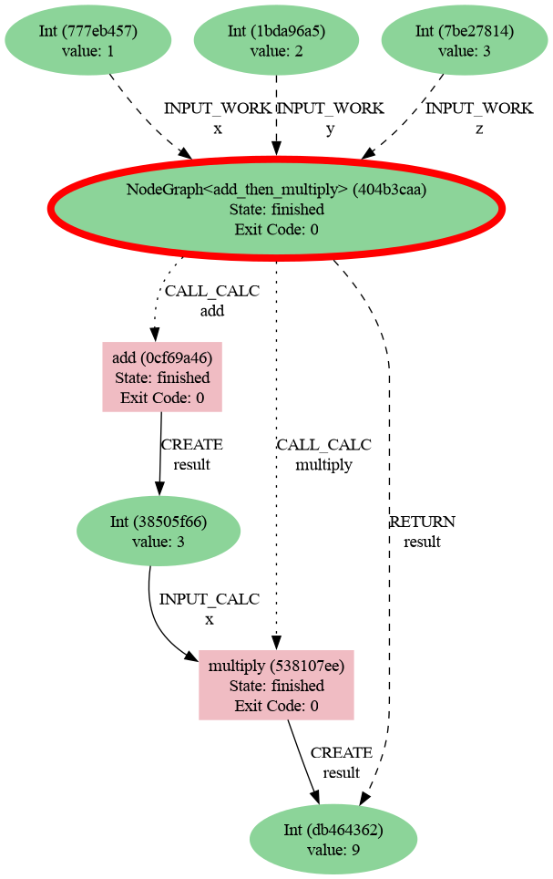

# node-graph Engine
[](https://badge.fury.io/py/node_graph_engine)
[](https://github.com/scinode/node-graph-engine/actions/workflows/ci.yaml)
[](https://codecov.io/gh/scinode/node-graph-engine)
[](https://node-graph-engine.readthedocs.io/en/latest/)

Execute node-graph workflows across multiple engines with consistent, provenance-rich records stored in AiiDA.

## Features

- Run the same workflow across multiple backends (local, Dask, Airflow, Prefect, Temporal, Dagster, Celery, Parsl, Redun, Jobflow, Executorlib)
- Uniform provenance capture powered by AiiDA for interoperability and reproducibility
- Simple Python-first API via the node-graph decorators (@task, @task.graph)
- Optional extras to install only the engines you need
- Ontology-aware semantics that keep JSON-LD annotations alongside each AiiDA task,
  including cross-socket references so property queries can span heterogeneous workflows

## Supported engines

node-graph Engine ships adaptors for a range of orchestration backends. Pick the engine that best matches your deployment target using the summary below and consult the documentation for integration details.

| Engine | Description |
| ------ | ----------- |
| [Local](https://node-graph-engine.readthedocs.io/en/latest/engines/local.html) | Run graphs locally inside the current Python process while capturing provenance. |
| [Airflow](https://node-graph-engine.readthedocs.io/en/latest/engines/airflow.html) | Materialise graphs as Airflow DAGs that can be scheduled and monitored in Apache Airflow. |
| [Dagster](https://node-graph-engine.readthedocs.io/en/latest/engines/dagster.html) | Launch graphs as Dagster jobs and surface executions in the Dagster UI via a configured instance. |
| [Dask](https://node-graph-engine.readthedocs.io/en/latest/engines/dask.html) | Execute task jobs through Dask's threaded scheduler, keeping provenance in the local AiiDA profile while resolving dependencies and nested graphs automatically. |
| [Celery](https://node-graph-engine.readthedocs.io/en/latest/engines/celery.html) | Submit nodes as Celery tasks so you can leverage existing brokers and workers while persisting provenance in AiiDA. |
| [Prefect](https://node-graph-engine.readthedocs.io/en/latest/engines/prefect.html) | Execute graphs as Prefect flows while streaming provenance back to the recorder. |
| [Temporal](https://node-graph-engine.readthedocs.io/en/latest/engines/temporal.html) | Run graphs as Temporal workflows and activities with Temporal's durability and visibility. |
| [Parsl](https://node-graph-engine.readthedocs.io/en/latest/engines/parsl.html) | Dispatch tasks to Parsl executors for parallel and distributed execution without losing provenance fidelity. |
| [Redun](https://node-graph-engine.readthedocs.io/en/latest/engines/redun.html) | Integrate with Redun workflows while preserving provenance throughout execution. |
| [Jobflow](https://node-graph-engine.readthedocs.io/en/latest/engines/jobflow.html) | Bridge to the Jobflow workflow system for materials science workloads with consistent provenance records. |
| [Executorlib (Pyiron)](https://node-graph-engine.readthedocs.io/en/latest/engines/executorlib.html) | Coordinate tasks with executorlib executors for provenance-rich high-throughput simulations. |

See the full [engine reference](https://node-graph-engine.readthedocs.io/en/latest/engines/) for prerequisites and examples.


## Installation

Core package:

```console
pip install --upgrade node_graph_engine
```

Install only the engines you need via extras:

```console
# Prefect
pip install node_graph_engine[prefect]

# Celery (bundles redis client)
pip install node_graph_engine[celery]

# Dask
pip install node_graph_engine[dask]

# Temporal
pip install node_graph_engine[temporal]

# Parsl
pip install node_graph_engine[parsl]

# Everything
pip install node_graph_engine[engines]
```

Provenance is stored in an AiiDA profile. Make sure AiiDA is installed and a local profile is initialised:

```console
pip install aiida-core
verdi presto
```


## Documentation
Read the full documentation at https://node-graph-engine.readthedocs.io/en/latest/


## Quick start
Simple two-step calculation: compute (x + y) * z

```python
from node_graph.decorator import task
from aiida import load_profile

load_profile()  # ensure AiiDA profile is loaded for provenance storage

@task()
def add(x, y):
    return x + y

@task()
def multiply(x, y):
    return x * y

@task.graph()
def AddMultiply(x, y, z):
    the_sum = add(x=x, y=y).result
    return multiply(x=the_sum, y=z).result
```

## Engines and provenance
Run graphs directly in Python with the Local engine:

```python
from node_graph_engine.engines.local import LocalEngine

graph = AddMultiply.build(x=1, y=2, z=3)

engine = LocalEngine()
results = engine.run(graph)
print(results)
```

The generated provenance graph:

</div>

<p align="center">

</p>


## Ontology-aware semantics

Socket metadata can include ontology terms that travel with your provenance. Annotate an output (or input) with
`typing.Annotated` and `node_graph.socket_spec.meta(semantics=...)` and the engine will merge the namespaces into
JSON-LD, storing the payload on the linked AiiDA `Data` nodes. Each node keeps a list of socket-level records that can
also reference other sockets via dotted paths such as `"outputs.result"`. This lets you declare facts like "this
StructureData input has a BandStructure result" without duplicating provenance or hard-coding downstream consumers.


## License
MIT — see the [LICENSE](LICENSE) file for details.
