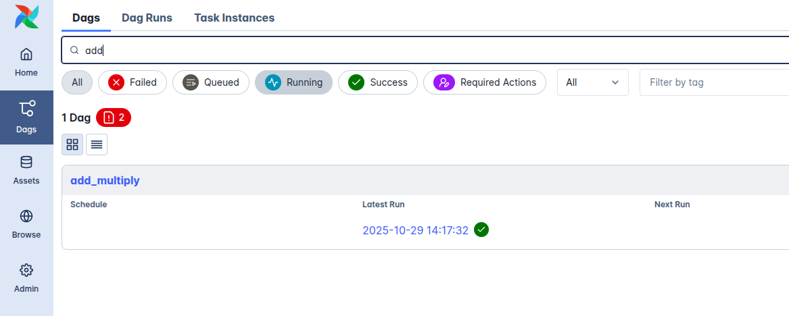
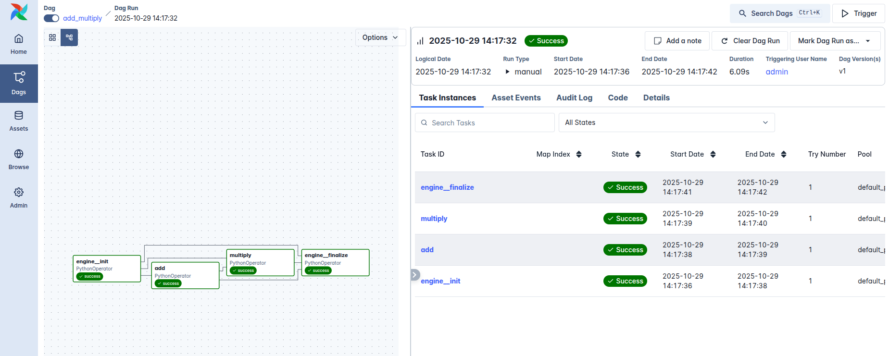
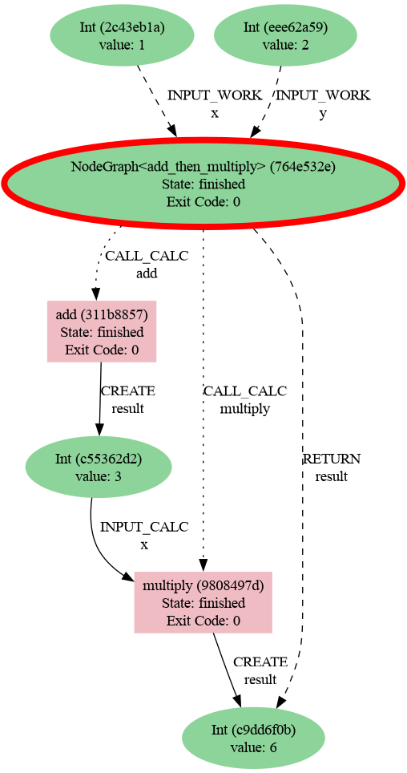
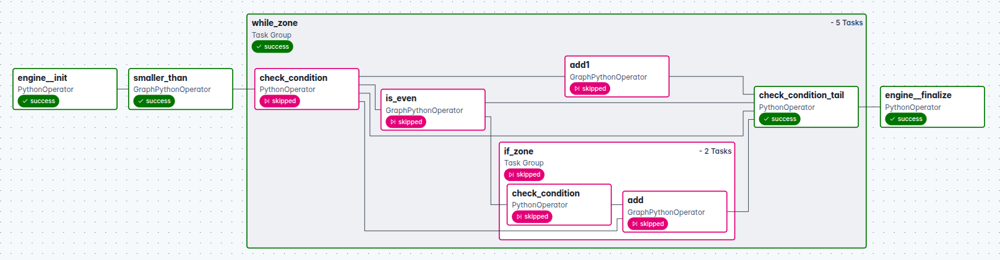

.. _engines-airflow:

Airflow engine
==============

The Airflow adaptor materialises the graphs as Apache Airflow DAGs so you can use
Airflow's scheduling, monitoring, and retry machinery while keeping provenance in AiiDA.
When the engine runs it serializes the graph and writes a Python module
into your Airflow DAG directory. That module de-serializes the graph, rebuilds the DAG,
and exposes it to the scheduler.

Installation
------------

1. Install the Airflow extra:

   .. code-block:: console

      pip install node_graph_engine[airflow]

.. note::

   There is a compatibility issue between Airflow 3.1 and AiiDa 2.7 for the moment.
   So you need to install these packages separately.

2. Start Airflow in standalone mode:

   .. code-block:: console

      airflow standalone

   This command starts the Airflow webserver and scheduler.
   It prints the generated username and password once the services are ready.
   Access the Airflow UI at ``http://localhost:8080``.

Example
-------

.. code-block:: python

   from aiida import load_profile
   from node_graph import task
   from node_graph_engine.engines.airflow import AirflowEngine

   load_profile()

   @task()
   def add(x, y):
       return x + y

   @task()
   def multiply(x, y):
       return x * y

   @task.graph()
   def add_then_multiply(x, y):
       the_sum = add(x=x, y=y).result
       return multiply(x=the_sum, y=y).result

   ng = add_then_multiply.build(1, 2)

   engine = AirflowEngine(dag_id="add_multiply")
   results = engine.run(ng)
   print("Result:", results)

Go to the Airflow UI at ``http://localhost:8080``.
Then search for the ``add_multiply`` DAG and monitor it.

Here is the preview of the Airflow UI showing the job execution:

Use AiiDA commands to inspect the processes and their provenance:

.. code-block:: console

   verdi process list -a

Which will show something like:

.. code-block:: console

   2206  7s ago     NodeGraph<add_then_multiply>         ⏹ Finished [0]
   2207  5s ago     add                                  ⏹ Finished [0]
   2209  4s ago     multiply                             ⏹ Finished [0]

Then generate a provenance graph for a workflow:

.. code-block:: console

   verdi node graph generate 2206 -f png

Here is the resulting graph:

Submitting workflows
--------------------
The Airflow engine supports two main methods to submit workflows:

* ``run()``: writes the DAG, registers and triggers a run immediately,
  and polls for the result file produced by the finalize task.

* ``submit()`` writes the DAG file and returns immediately. The scheduler will trigger it later.
  The Airflow scheduler only discovers new DAG files on
  its refresh cycle (default ``refresh_interval`` is 300 seconds). Run
  ``airflow dags reserialize`` if you want immediate registration without waiting for the
  processor.

For high-throughput workloads you can issue many ``submit()`` calls and
batch-register them with a single ``airflow dags reserialize`` command in the terminal.

Nested and dynamic workflows
----------------------------

Nested ``@task.graph`` workflows are supported. Whenever the engine encounters a nested
graph it generates a sub-DAG on the fly, writes it next to the parent DAG, and triggers
it. Because the engine can emit sub-DAGs dynamically, Graph-controlled constructs
such as ``if``/``else`` branches, ``for`` loops, or ``while`` loops translate naturally
into Airflow DAGs and runs.

Asynchronous tasks
------------------

Tasks implemented as ``async`` functions are converted into Airflow Deferrable
Operators with matching triggers. This lets you take advantage of Airflow's asynchronous
execution model without changing your Graph task definitions.

If/While zones
--------------
Airflow also supports ``If`` and ``While`` zones defined in ``node-graph``. These are
compiled into TaskGroups with condition checks and body tasks.

Here is an example of sum of even numbers using ``If`` and ``While`` zones.

.. code-block:: python

   from aiida import load_profile
   from node_graph import task, get_current_graph
   from node_graph.manager import If, While
   from node_graph_engine.engines.airflow import AirflowEngine

   load_profile()

   @task()
   def smaller_than(x, y):
      return x < y

   @task()
   def add(x, y):
      return x + y

   @task()
   def is_even(x):
      return x % 2 == 0

   @task.graph()
   def while_with_if(index=0, limit=10,
                     total=0,
                     increment=1):

      graph = get_current_graph()
      graph.ctx.total = total
      graph.ctx.index = index
      condition = smaller_than(graph.ctx.index, limit).result

      with While(condition):
         is_even_cond = is_even(graph.ctx.index).result
         with If(is_even_cond) as if_zone:
               graph.ctx.total = add(x=graph.ctx.total, y=graph.ctx.index).result
         next_index = add(x=graph.ctx.index, y=increment).result
         graph.ctx.index = next_index
         if_zone >> next_index

      return graph.ctx.total

   graph = while_with_if.build(index=1, limit=5, increment=1, total=0)
   engine = AirflowEngine("test_sum_even_numbers")

   dag = engine.build_dag(graph)

Here is the resulting graph:

Under the hood
---------------

The engine serializes the current Graph definition, writes a Python DAG wrapper
alongside the payload in ``$AIRFLOW_HOME/dags`` (defaulting to ``@once`` if you did not
provide a schedule).
Each submit uses a unique DAG id and file name (base id plus a UUID suffix) to avoid collisions between runs.
