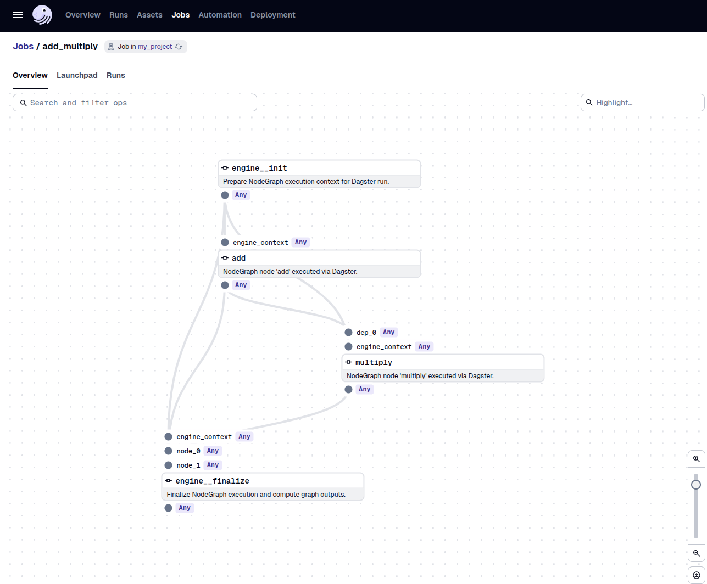
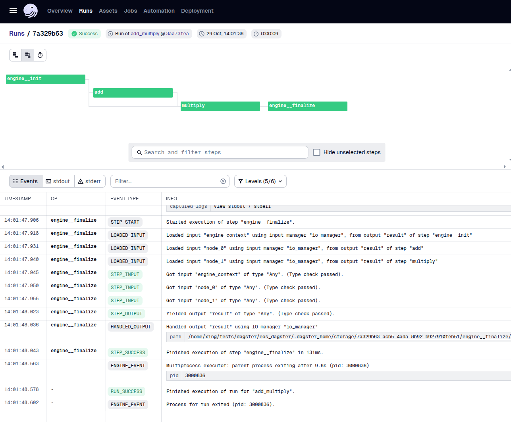
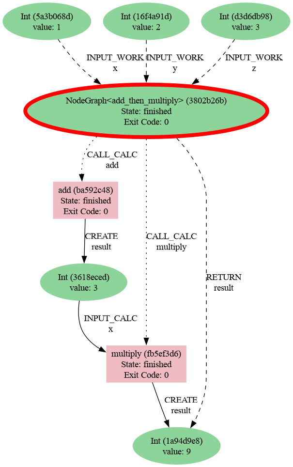

.. _engines-dagster:

Dagster engine
==============

The Dagster adaptor materialises workflows as Dagster jobs so that you can
operate them through Dagster's tooling (UI, sensors, schedules) while preserving AiiDA
provenance.

Installation
------------

Install the Dagster extra:

.. code-block:: console

   pip install node_graph_engine[dagster]

Setup an AiiDA profile

.. code-block:: console

   verdi presto

Docker quickstart
-----------------

Run the Dagster webserver in Docker and point the engine at the shared
``DAGSTER_HOME``:

.. code-block:: console

   docker compose -f docker-compose.yml --profile integration up -d dagster
   export DAGSTER_HOME=$PWD/tests_integration/.dagster

You still need the Dagster extra installed locally so the engine can build jobs.

Example project
---------------

1. Scaffold a Dagster project

.. code-block:: console

   dagster project scaffold --name my_project
   cd my_project

2. Replace the generated ``my_project/__init__.py`` with the following content to define
   a workflow and expose it to Dagster:

   .. code-block:: python

      from dagster import DagsterInstance, Definitions
      from node_graph_engine.engines.dagster import DagsterEngine
      from aiida import load_profile
      from node_graph import task

      load_profile()

      @task()
      def add(x, y):
          return x + y

      @task()
      def multiply(x, y):
          return x * y

      @task.graph()
      def add_then_multiply(x, y, z):
          the_sum = add(x=x, y=y).result
          return multiply(x=the_sum, y=z).result

      ng = add_then_multiply.build(x=1, y=2, z=3)

      engine = DagsterEngine("add_multiply", instance=DagsterInstance.get())
      job = engine.build_job(ng)
      defs = Definitions(jobs=[job])

3. Start the Dagster development server from the project directory.

.. code-block:: console

   dagster dev -m my_project

4. Go to the `Jobs` tab in the Dagster UI, and find the ``add_multiply`` job.
   Click on it, then click on the `Launchpad` tab to run the job.

Here is the preview of the Dagster UI showing the job execution:

Use AiiDA commands to inspect the processes and their provenance:

.. code-block:: console

   verdi process list -a

Which will show something like:

.. code-block:: console

   2214  11s ago    NodeGraph<add_then_multiply>         ⏹ Finished [0]
   2215  8s ago     add                                  ⏹ Finished [0]
   2217  6s ago     multiply                             ⏹ Finished [0]

Then generate a provenance graph for a workflow:

.. code-block:: console

   verdi node graph generate 2214 -f png

Here is the resulting graph:

