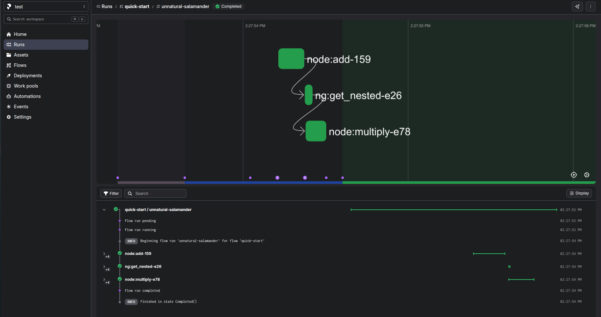
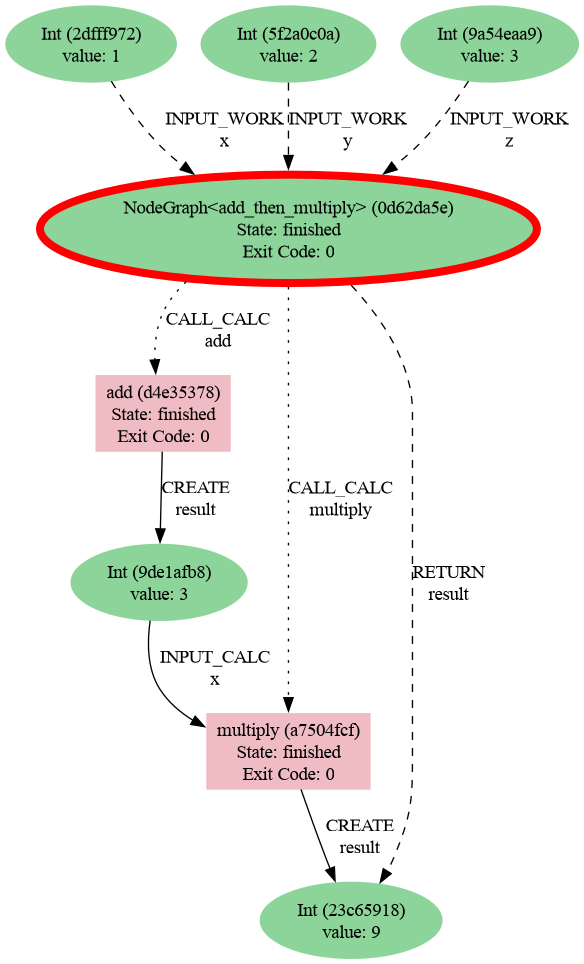

.. _engines-prefect:

Prefect engine
==============

The Prefect adaptor converts graphs into Prefect 3 flows so that you can
execute them with Prefect's task runner infrastructure while streaming provenance back
to AiiDA.

Installation
------------

1. Install the Prefect extra for Graph Engine. This pulls in ``prefect`` and the
   adaptor dependencies:

   .. code-block:: console

      pip install node_graph_engine[prefect]

2. Start a local Prefect 3 server:

   .. code-block:: console

      prefect server start

   Leave this running while you create deployments or serve flows. The Prefect UI will
   be available on the printed URL (default http://127.0.0.1:4200).
   Or, you can set up the `Prefect Cloud <https://docs.prefect.io/v3/how-to-guides/cloud/connect-to-cloud>`_.

Docker quickstart
-----------------

Run the Prefect server in Docker and point your client at it:

.. code-block:: console

   docker compose -f docker-compose.yml --profile integration up -d prefect
   export PREFECT_API_URL=http://localhost:4200/api

You still need the Prefect extra installed locally so the engine can build flows.

Example
-------

The example below mirrors the quick-start computation but runs it through Prefect. The
engine returns resolved values; Prefect task futures are handled internally.

.. code-block:: python

   from aiida import load_profile
   from node_graph import task
   from node_graph_engine.engines.prefect import PrefectEngine

   load_profile()

   @task()
   def add(x, y):
       return x + y

   @task()
   def multiply(x, y):
       return x * y

   @task.graph()
   def add_then_multiply(x, y, z):
       the_sum = add(x=x, y=y).result
       return multiply(x=the_sum, y=z).result

   graph = add_then_multiply.build(x=1, y=2, z=3)

   engine = PrefectEngine(flow_name="quick-start")
   outputs = engine.run(graph)
   print(outputs)

Inspect the Prefect UI for task-level details.

Use AiiDA commands to inspect the processes and their provenance:

.. code-block:: console

   verdi process list -a

Which will show something like:

.. code-block:: console

   2199  3m ago     NodeGraph<add_then_multiply>         ⏹ Finished [0]
   2200  3m ago     add                                  ⏹ Finished [0]
   2202  3m ago     multiply                             ⏹ Finished [0]

Then generate a provenance graph for a workflow:

.. code-block:: console

   verdi node graph generate 2199

Here is the resulting graph:

Serving to a work pool (remote workers)
---------------------------------------

``PrefectEngine`` can also produce a servable Prefect 3 flow that you register to a work
pool so remote workers execute your Graph while AiiDA provenance is captured
identically. Create a work pool to which workers can connect:

.. code-block:: console

   prefect work-pool create my-process-pool --type process

Start a worker on the remote machine (with the same Python environment and AiiDA profile
available) to pick up submitted runs:

.. code-block:: console

   prefect worker start --pool my-process-pool

Each scheduled run reconstructs the Graph on the worker, executes the tasks through
Prefect, and emits byte-identical AiiDA provenance regardless of where the worker runs.

Save the following as e.g. ``flow.py`` in a git repository:

.. code-block:: python

   from aiida import load_profile
   from prefect import flow
   from node_graph_engine.engines.prefect import PrefectEngine

   load_profile()

   graph = add_then_multiply.build(x=1, y=2, z=3)
   engine = PrefectEngine(flow_name="ng-eos")

   @flow(name="add-multiply-deployment")
   def run_ng():
       return engine.run(graph)

And then deploy it from your local machine:

.. code-block:: python

   from prefect import flow

   if __name__ == "__main__":
      flow.from_source(
         source="https://github.com/superstar54/test-prefect.git",
         entrypoint="flow.py:run_ng",
      ).deploy(
         name="run-ng-from-thinkpad",
         work_pool_name="my-process-pool",
      )

.. note::
      Ensure that the remote environment has access to the same AiiDA profile and
      database as the local machine to maintain consistent provenance tracking.
