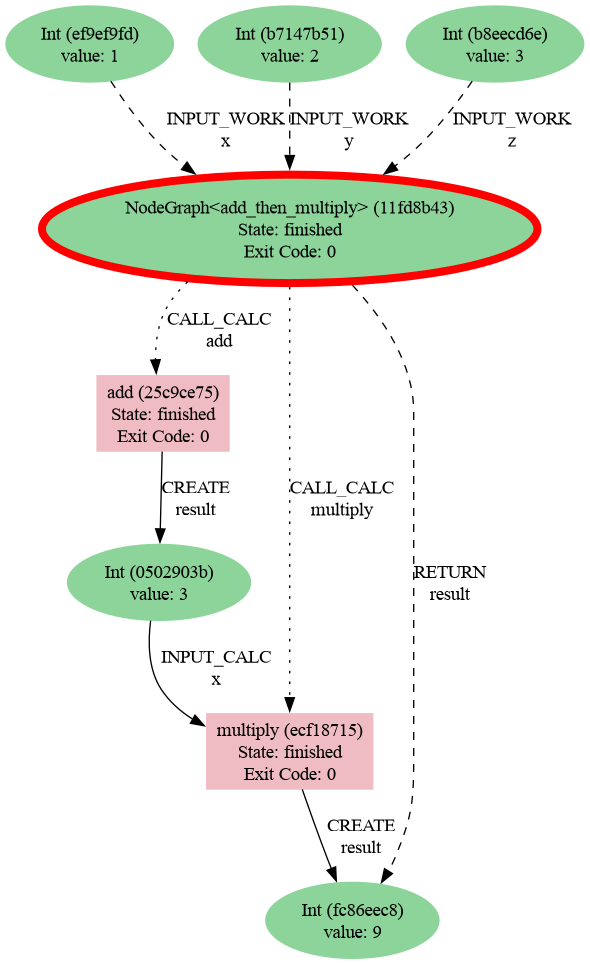

.. _engines-redun:

Redun engine
============

The Redun adaptor submits tasks to a Redun scheduler. It bridges Redun's
asynchronous execution model with AiiDA provenance so you can analyse runs in both
systems simultaneously.

Installation
------------

1. Install the Redun extra:

   .. code-block:: console

      pip install node_graph_engine[redun]

2. Initialise a Redun project (for example inside your repository) if you do not have
   one already:

   .. code-block:: console

      redun init

   Adjust ``redun.ini`` to point to the storage backend you intend to use. The default
   in-memory database works for quick experiments.

3. Load an AiiDA profile in the environment that launches the Redun scheduler.

Example
-------

.. code-block:: python

   from aiida import load_profile
   from node_graph import task
   from node_graph_engine.engines.redun import RedunEngine

   load_profile()

   @task()
   def add(x, y):
       return x + y

   @task()
   def multiply(x, y):
       return x * y

   @task.graph()
   def add_then_multiply(x, y, z):
       the_sum = add(x=x, y=y).result
       return multiply(x=the_sum, y=z).result

   graph = add_then_multiply.build(x=1, y=2, z=3)

   engine = RedunEngine(name="redun-quick-start")
   outputs = engine.run(graph)
   print(outputs)

Use AiiDA commands to inspect the processes and their provenance:

.. code-block:: console

   verdi process list -a

Which will show something like:

.. code-block:: console

   2230  4s ago     NodeGraph<add_then_multiply>         ⏹ Finished [0]
   2231  4s ago     add                                  ⏹ Finished [0]
   2233  4s ago     multiply                             ⏹ Finished [0]

Then generate a provenance graph for a workflow:

.. code-block:: console

   verdi node graph generate 2230 -f png

Here is the resulting graph:

