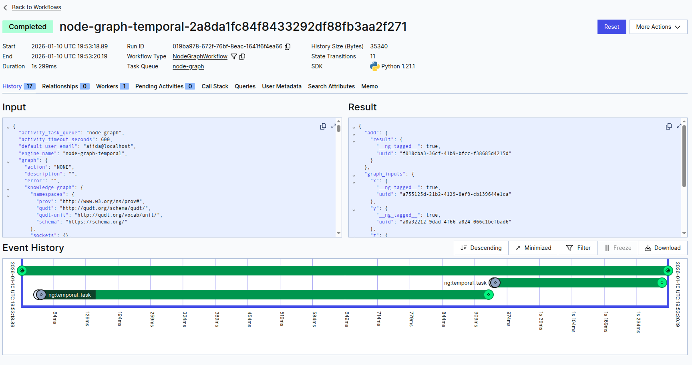
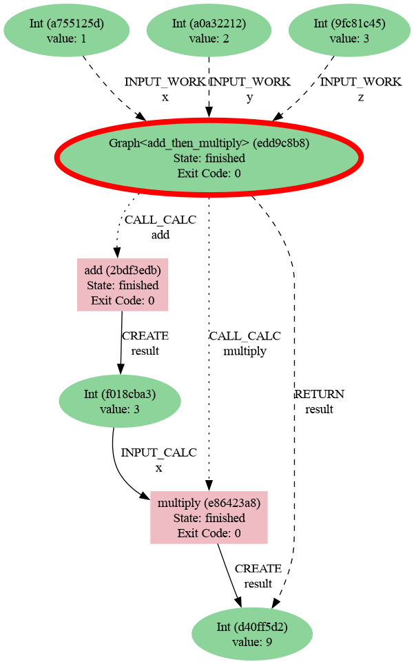

.. _engines-temporal:

Temporal engine
===============

The Temporal adaptor converts graphs into Temporal workflows that schedule each graph
task as an activity, so you can execute node-graph workloads on Temporal workers while
recording provenance in AiiDA.

Installation
------------

1. Install the Temporal extra for Graph Engine. This pulls in ``temporalio`` and the
   adaptor dependencies:

   .. code-block:: console

      pip install node_graph_engine[temporal]

2. Install the Temporal CLI following the instructions at
   `Temporal CLI Installation <https://learn.temporal.io/getting_started/python/dev_environment/?os=linux#set-up-a-local-temporal-service-for-development-with-temporal-cli>`_.

3. Start a Temporal dev server (or connect to your existing deployment):

   .. code-block:: console

      temporal server start-dev

Docker quickstart
-----------------

Run the Temporal dev server in Docker and connect to it from the engine:

.. code-block:: console

   docker compose -f docker-compose.yml --profile integration up -d temporal
   export TEMPORAL_ADDRESS=localhost:7233

You still need the Temporal extra installed locally to run workflows and activities.

Example
-------

Run a worker that registers the workflow and activity definitions:

.. code-block:: python

   import asyncio
   from temporalio.client import Client
   from temporalio.worker import Worker
   from node_graph_engine.engines.temporal import (
       TemporalEngine,
       NodeGraphWorkflow,
       temporal_node_task,
   )
   from aiida import load_profile

   load_profile()

   async def main():
       client = await Client.connect("localhost:7233")
       engine = TemporalEngine(task_queue="node-graph")
       worker = Worker(
           client,
           task_queue=engine.task_queue,
           workflows=[NodeGraphWorkflow],
           activities=[temporal_node_task],
       )
       await worker.run()

   asyncio.run(main())

.. note::
   Temporal workers must have access to the same AiiDA profile and database as the
   client process to preserve provenance links.

Then submit a graph from a client process:

.. code-block:: python

   import asyncio
   from aiida import load_profile
   from node_graph import task
   from temporalio.client import Client
   from node_graph_engine.engines.temporal import TemporalEngine

   load_profile()

   @task()
   def add(x, y):
       return x + y

   @task()
   def multiply(x, y):
       return x * y

   @task.graph()
   def add_then_multiply(x, y, z):
       the_sum = add(x=x, y=y).result
       return multiply(x=the_sum, y=z).result

   graph = add_then_multiply.build(x=1, y=2, z=3)

   async def run():
       client = await Client.connect("localhost:7233")
       engine = TemporalEngine(task_queue="node-graph")
       outputs = await engine.run_async(graph, client=client)
       print(outputs)

   asyncio.run(run())

Here is the preview of the Temporal UI showing the job execution:

Use AiiDA commands to inspect the processes and their provenance:

.. code-block:: console

   verdi process list -a

Which will show something like:

.. code-block:: console

   14915  4m ago     Graph<add_then_multiply>                  ⏹ Finished [0]
   14916  4m ago     add                                       ⏹ Finished [0]
   14918  4m ago     multiply                                  ⏹ Finished [0]

Then generate a provenance graph for a workflow:

.. code-block:: console

   verdi node graph generate 14915 -f png

Here is the resulting graph:

